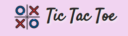
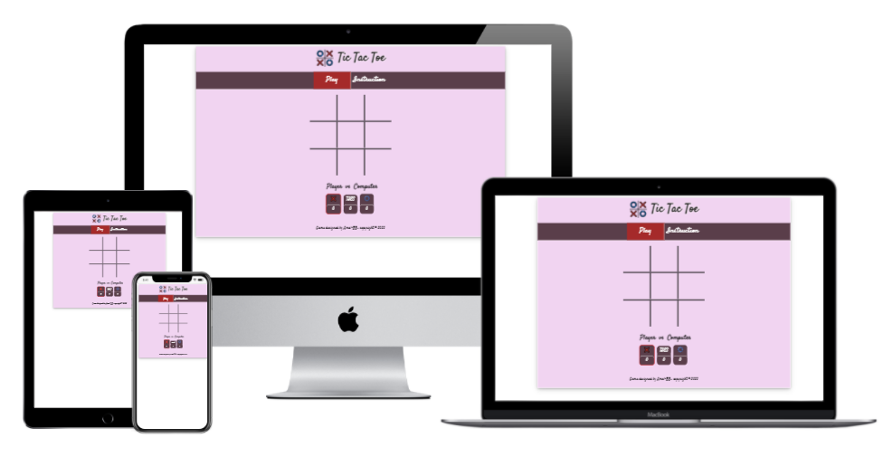

# Tic-Tac-Toe Game

## 1. Project Overview
A traditional **Tic Tac Toe** game has been developed in modern design for people who like to get in challenge to play against a computer and have fun.

#### [Try it here..](https://amal-bb.github.io/Tic-Tac-Toe-Game/)

+ ### **User Stories**

   As a *visiting user*, I would like to:

  * Easly understand how to play the game.
  * See if I've won, lost, or tied.
  * Be able to track my score from game to game.
  * Be able to change my symbol (X or O) at any stage of playing the game.
  * Be able to play it on my mobile, tablet, or pc.
  * Feel I'm in the real challenge while playing against a computer.

