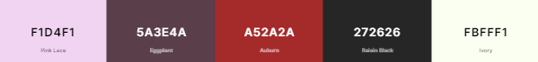
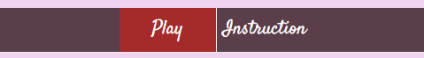
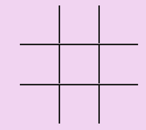
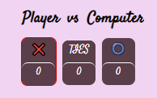
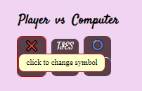
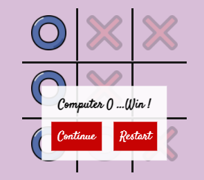
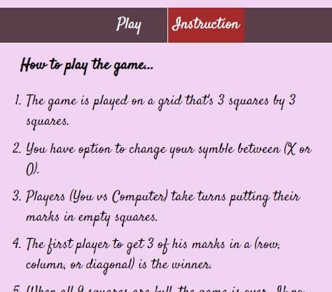
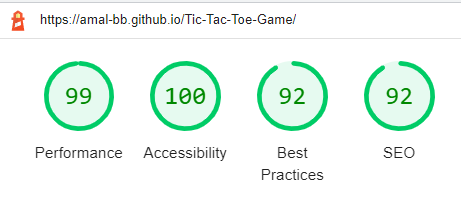
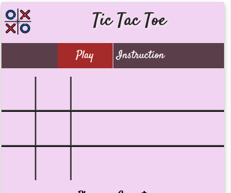

# Tic-Tac-Toe Game

## 1. Project Overview
A traditional **Tic Tac Toe** game has been developed in modern design for people who like to get in challenge to play against a computer and have fun.

#### [Try it here..](https://amal-bb.github.io/Tic-Tac-Toe-Game/)

+ ### **User Stories**

   As a *visiting user*, I would like to:

  * Easly understand how to play the game.
  * Know if I've won, lost, or tied.
  * Be able to track my score from one game to another.
  * Be able to change my symbol (X or O) at any stage of playing the game.
  * Realize which player has the current turn.
  * Be able to reset my score to start a new game.
  * Be able to play it on my mobile, tablet, or pc.
  * Feel I'm in a real challenge while playing against a computer.

----
## 2. Design

+ ### **Colours**

    

    * Colours schema of purple and red have been used and [color contrast](media/colorsContrast.PNG) has been tested .

+ ### **Typography**

   * [**Satisfy**](https://fonts.google.com/specimen/Satisfy?preview.text=Tic%20Tac%20Toe&preview.text_type=custom#about) font is used throughout the whole project. It gives a look of a timeless classic with a unique modern flair.

   * Serif has been used for player symbol's hover description. 

+ ### **Imagery**

   * The selected color pattern including font and colored symbols are used to give the game a modern and attractive look.

## 3. Features
  
The project has been designed to be responsive on all device sizes.

### **Existing Features**

+ ### **Game Logo and Heading** 
 
  * Featured at the top of the page, the Tic Tac Toe logo and heading is easy to see for the user. Upon viewing the page, the user will be able to see the name of the game.

    

+ ### **Game Menu**
   
   *  The menu is clear and easy to use. It allowed the user to navigate between play area and game instruction.

      

+ ### **Play Area**

   * Game Area: In this section, the user will be able to play the game. It allowed the user to put his symbol by clicking on an empty cell in the game grid. 

      

   * Score and Symbol Area: 
      - This section will display players' names, symbols and scores.
      - It allows the user to track his score and know who has a turn, which will be highlighted by a red border.

         

      - The user will be able to change his symbol by clicking on it, the message of (click to change symbol) will appears when the player symbol is hovered.

         

+ ### **Dialog Box**
    
    * This dialog box appears each time the game end. It allows the user to know who wins the game or if it ended with a tie. The user will be able to choose to continue playing or start a new game. 
      
       

+ ### **Instruction Area**
    
    * This section will have the playing instruction, it will allow the user to know how to play the game.

        

### **Features Left to Implement**

   * Add option of playing level. This will allow the user to choose the level of playing easy or hard.

   * Add another option of playing against another player. This will allow the user to have more fun playing the game with his friends. 

## 5. Used Technologies

+ ### **languages**    
   * [Html5](https://en.wikipedia.org/wiki/HTML5), [CSS3](https://en.wikipedia.org/wiki/CSS), and [JavaScript](https://developer.mozilla.org/en-US/docs/Web/JavaScript) languages are used in this project.

+ ### **Other Technologies**

  * [GitHub](https://github.com/) is used to store the project code and host it. 

  * [Techsini](http://techsini.com/multi-mockup/index.php) was used to generate The multi device mockup (_The image attatched here in readme_). 

  * [Coolors](https://coolors.co/) was used to genetate colours palette , and [Contrast Grid](https://contrast-grid.eightshapes.com) was used to check the colours contrast.
 
  * [Google Font](https://developers.google.com/fonts) were used to import the used font into the style.css file.

  * [Flat Icon](https://www.flaticon.com/) was used for project icons.

 ## 6. Testing and Validtor

 * The responsive view for the project has been tested in a range of screen sizes via [Chrome DevTools](https://developer.chrome.com/docs/devtools/).

 * The project was tested on **Chrome**, **IE**, and **Firefox** browsers, furthermore have been tested on a variety of devices such as: _Desktop, iPhon8, iPhone, iPhon12, Galaxy A12 and Tablet_.

+ ### **Code Validation**

   * [HTML Validation Result](media/htmlValidator.PNG) : No errors were returned for **Html Code** when passing through the offical [W3C Validator](https://validator.w3.org/nu/?doc=https%3A%2F%2Famal-bb.github.io%2FTic-Tac-Toe-Game%2F).

   * [CSS Validation Result](media/cssValidation.PNG) : No errors were returned for **CSS Code** when passing through the offical [Jigsaw Validator](https://jigsaw.w3.org/css-validator/validator?uri=https%3A%2F%2Famal-bb.github.io%2FTic-Tac-Toe-Game%2F). 

   * [JS Validation Result](media/jsHint.PNG) : No errors were returned for **Java Script Code** when passing through the offical [JSHint Validator](https://jshint.com/)

   * Project **Accessibility** has been checked through [Lighthouse](https://developers.google.com/web/tools/lighthouse) in Chrome DevTools. The result is shown below.

     

+ ### **Testing User Stories Cases**

   * Easly understand how to play the game.
     
      + Upon entering the game page, the user is greeted with a clear menu has two sections (play and instruction), the user can navigate to instruction where he will find how to play the game.
      + The menu is located in an easily identifiable location and the active page will be highlighted by red color in the menu.
      + The instruction on how to play the game is ordered in points which is easy to follow and understand.

   * Know if I've won, lost, or tied.
     
      + In case the user or computer has 3 selected cells matching one of the winning states, then just these cells will stay highlighted.
      + The dialog box will appear a message that shows the winner's name with his symbol. 
      + In case the game ends with a tie, the dialog box will appear with the message "Game Over".  

   * Be able to track my score from one game to another.

     + The score area is located under the game grid, It has three boxes one for the player score, one for the tie, and one for the computer. 
     + Each time the game end by winning state or tie state the score box is automatically updated.
      
   * Be able to change my symbol (X or O) at any stage of playing the game.

     + The player symbol is shown over the player score box, by clicking on it before starting the game or while playing, then the symbol will be changed from ( X to O ) or vice versa.

   * Realize which player has the current turn.
     
     + The (symbol and score) box under the name of (player or computer) will be highlighted by a red border for the one who has the current turn.

   * Be able to reset my score to start a new game.

     + Each time the game end, the dialog box will appear with two options (Continue and Restart).
     + When the user chooses Restart, all scores will be reset to 0, thus the user will be able to start a new game..

   * Be able to play it on my mobile, tablet, or pc.

     + The game page has been designed to be responsive on all device sizes and to be easy to use.

   * Feel I'm in a real challenge while playing against a computer.

      + The game has been coded to choose the best random states for the computer that let it able to win the user and do not give chance for the user to win it easily.

## 7. Bugs and Fixing

All reported bugs from testing has been fixed.

+ ### **Fixed Bugs**

   * Fixed an issue where the user symbol wouldn't change correctly in the game grid cells when the user click on the player symbol box to change his game symbol. This issue was solved by fixing the JS code inside the function `changePlayerIcon()`.

   * Fixed an issue of the delay in showing the game symbols on cells, which caused a display of the dialog box, and execute the next codes before all symbols have appeared in the game grid cells. This issue has been addressed by using the JS `sleep-await` and `setTimeOut` function.

   * Fixed an issue where the style of the (symbol and score) box wasn't changed correctly to be highlighted with a red border to indicate who has a turn while playing the game. By updating the JS code of `changeTurn` function via using `classList.toggle` the issue was solved.

   * Fixed an issue for the messy viewing of the game grid and the game logo when tested in IE and Firefox browsers. This issue has been solved by adding `display:table` property in the CSS file because these browsers do not support the value of `width:fit-content`. 

     

## 8. Deployment
  
* ### **Via Gitpod**
  
  The project code has been run in Gitpod using following steps:

  1. Install the Gitpod browser extension.
  
  1. Log into your Github account, then navigate to your project [Repository](https://docs.github.com/en/repositories).

  1. You will find a green Gitpod button has appeared.

  1. Press **Gitpod** button, you will direct to GitPod page.
  
  1. At the first time you need to authorize, so press **Authorize Gigpod**, then you will be directed to Create Account page.
  
  1. Click accept terms to start up your workspace in Gitpod.

* ### **Via GitHub Pages**
  
  The project was deployed via Github pages by using following steps:

  1. Log into your Github account.

  1. Navigate to the Repository, click the **Setting** button at the top menu.
  
  1. Click the **Pages** option, located on the left-side menu.
  
  1. Under **Source**, click the dropdown list titled "None", and select branch named "main". 
  
  1. Click **Save**. The site now deployed and the published site link will be created.

* ### **Making a Local Clone**

  1. Log in to GitHub and locate the GitHub Repository.

  1. Under the repository name, click "Clone or download".

  1. To clone the repository using HTTPS, under "Clone with HTTPS", copy the link.

  1. Open Git Bash.

  1. Change the current working directory to the location where  you want the cloned directory to be made.

  1. Type `git clone`, and then paste the URL you copied in Step 3.

      ` $ git clone https://github.com/YOUR-USERNAME/YOUR-REPOSITORY `

   1. Press Enter. Your local clone will be created.
   
       `$ git clone https://github.com/YOUR-USERNAME/YOUR-REPOSITORY`
   
       `Cloning into  CI-Clone ...`
     
       `remote: Counting objects: 10, done.`

       `remote: Compressing objects: 100% (8/8), done.`
     
       `remove: Total 10 (delta 1), reused 10 (delta 1)`
     
       `Unpacking objects: 100% (10/10), done.`  

## 9. Credits
 
 * ### **Code**

 The project code was developed by me (Amal-BB), with some ideas modified and some bugs solved by the following tutorials. 

   * The general idea of how creating the game variables was taken from [Webtips tutorial](https://www.webtips.dev/tic-tac-toe-in-javascript) with new modifyings have been added and developed for the current project.

   * Creating dialog box was followed [Code Boxx tutorial](https://code-boxx.com/display-messages-html-javascript/) with some modifications to suit.

   * Using JavaScript Async to fix the issue of execution delay was followed [W3schools tutorial](https://www.w3schools.com/js/js_async.asp).

   * Solving the issue of IE and Firefox not supporting `width:fit-content` was taken from [stackoverflow](https://stackoverflow.com/questions/49095440/width-fit-content-working-on-chrome-but-not-explorer).

    
   

